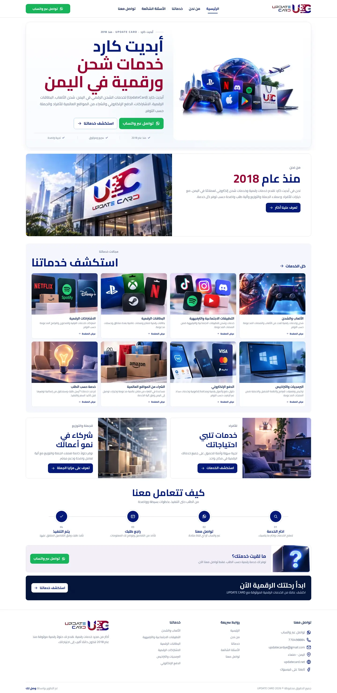
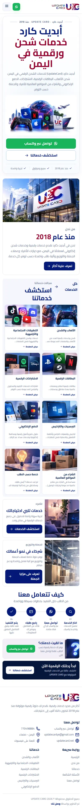

# UPDATE CARD | أبديت كارد

موقع تعريفي وتجاري سريع لخدمات **UPDATE CARD** الرقمية في اليمن، يعرض فئات الشحن والبطاقات والاشتراكات والدفع والشراء الإلكتروني، ويوجّه العميل إلى طلب الخدمة مباشرة عبر واتساب.

[زيارة الموقع](https://updatecard.net) · [استعراض الخدمات](https://updatecard.net/services/) · [التواصل](https://updatecard.net/contact/)

## لقطات المشروع

### سطح المكتب



### الهاتف

<p align="center">
  
</p>

## ماذا يقدم المشروع؟

- واجهة عربية كاملة واتجاه RTL ومتجاوبة مع الهاتف وسطح المكتب.
- صفحات مستقلة لفئات الخدمات وصفحات فرعية لخدماتها المتاحة.
- مسار طلب مباشر عبر واتساب مع رسائل مُهيّأة حسب الخدمة.
- مقدمة شعار إلزامية وخفيفة للزيارة الأولى، ثم دخول سلس إلى الموقع.
- صور AVIF/WebP محسّنة وتحميل كسول للصور غير الحرجة.
- خط Cairo مستضاف محليًا دون طلبات خطوط خارجية.
- SEO تقني: canonical، sitemap، robots، Open Graph، Twitter Cards وJSON-LD.
- أساسيات الوصول: معالم دلالية، رابط تجاوز، تسميات واضحة ودعم تقليل الحركة.
- فحوصات آلية للبناء والروابط والصور وميزانيات الأداء واللقطات البصرية.

## التقنية

- JavaScript بنمط ES Modules
- HTML متعدد الصفحات يُولَّد وقت البناء
- CSS مخصص ومتجاوب
- Node.js 24
- GitHub Actions
- Vercel

لا يستخدم المشروع إطار واجهات أو مكتبة حركة؛ الواجهة مبنية بخفة باستخدام HTML وCSS وJavaScript.

## التشغيل محليًا

المتطلبات: Node.js `24.x` وnpm.

```bash
npm run dev
```

ثم افتح `http://localhost:4173`.

للتحقق من نسخة الإنتاج محليًا:

```bash
npm run build
npm run check
```

يُنشأ ناتج البناء داخل `dist/`، وهو مجلد مولّد وغير محفوظ في Git.

## هيكل المستودع

```text
.
├── brand/                  # أصول الشعار والهوية وملفات المنصات
├── docs/
│   ├── ARCHITECTURE.md     # بنية المشروع ومسار البناء والنشر
│   └── screenshots/        # لقطات العرض المعتمدة
├── scripts/                # البناء، الفحص وخادم المعاينة
├── src/
│   ├── assets/             # الصور، الوسائط والخطوط
│   ├── client/             # سلوك المتصفح
│   ├── components/         # المكونات المشتركة
│   ├── config/             # بيانات الموقع العامة
│   ├── data/               # الخدمات والأسئلة ومسارات الطلب
│   ├── pages/              # قوالب الصفحات
│   ├── styles/             # نظام CSS
│   └── templates/          # القالب العام للموقع
├── package.json
└── vercel.json
```

للتفاصيل الهندسية راجع [بنية المشروع](docs/ARCHITECTURE.md)، ولأصول الهوية راجع [دليل الهوية](brand/README.md).

## الصفحات

- الرئيسية، من نحن، الخدمات، الأسئلة الشائعة، تواصل معنا و404.
- الألعاب والشحن.
- التطبيقات الاجتماعية والترفيهية.
- البطاقات الرقمية.
- الاشتراكات الرقمية.
- البرمجيات والتراخيص.
- الدفع الإلكتروني.
- الشراء من المواقع العالمية.
- خدمة حسب الطلب.

## الجودة والنشر

كل تحديث على `main` يمر عبر Site CI الذي يبني الموقع ويفحص المسارات والمراجع والصور وميزانيات الأصول، ثم ينشر Vercel النسخة الإنتاجية على [updatecard.net](https://updatecard.net).

## دوري في المشروع

تصميم وتجهيز الهوية الرقمية، هندسة الواجهة، تطوير الموقع، تحسين الأداء وSEO، إعداد الاختبارات الآلية والنشر.

**التنفيذ والتطوير:** م. إلياس الشعيبي — [وصل تك](https://www.wasl-tech.com)
